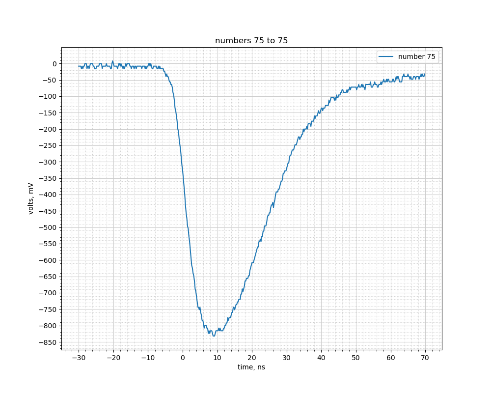

# Some data files from the Cosmic Ray Muon Detectors (CRMDs).

## Time-over-thresholds

**savesets200620_185602**  are PMT signals from S/N 6165 Ch 4, with a -300mV falling edge trigger, 50 Ohm termination.  Contains 76 'scope traces, 
CSV and graphics files.

**savesets200620_184105**  are PMT signals from S/N 6165 Ch 4, with a -100mV falling edge trigger, 50 Ohm termination.  Contains 33 'scope traces, 
CSV and graphics files.

Using the -300 mV set create divvy out the graphics and have folks find three number for each trace on the plot (usually 5 traces): the 
time-over-threshold, the "peak" (negative going), and the approximate area (units of V*ns is fine). 
a) Histogram the TOTs. 
b) See if there is any correlation between the Peak and the TOT. 
c) See if there is any correlation between the Area and the TOT. 

A good guess is that the area under this curve is proportional to the total energy in photons that the passing muon created interacting with the
fluor in the scintillator plastic.

**waves75to80.png** really has trace number 75 only. 

